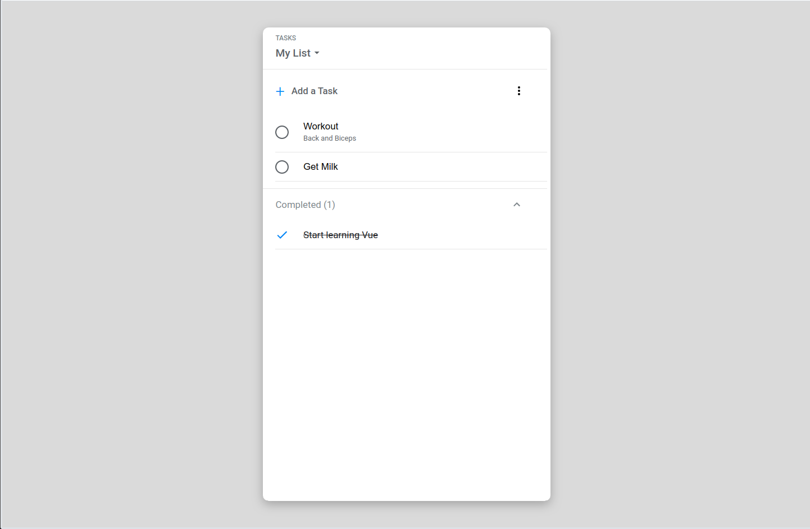

# A Google Tasks clone built with Vue and Vuex

## <a href="https://tasks-clone.netlify.com/" target="_blank">Live Demo</a>



## Project setup and start 🏃

```
yarn install && yarn serve
```

### To create a production build in the /dist directory 👷

```
yarn build
```

## Motivation? 🤔

I've been a life long _React.js_ developer, but have never dove deep into any other framework. So I started this project as a **Vue.js** learning sandbox. I chose the Google Tasks app to clone as it is a more advanced implementation of the iconic "todo list first project" and seemed to have all the basic features a fully fledged web app would have.
